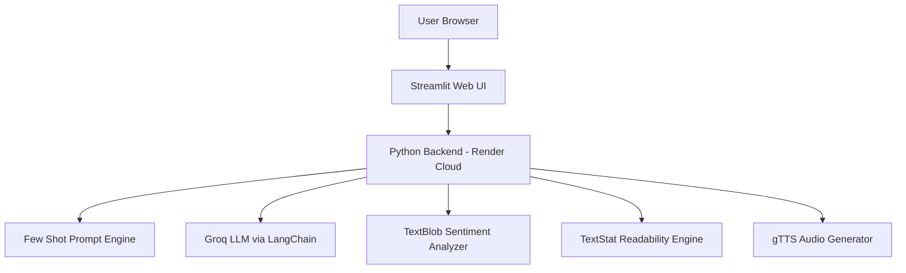

# AI-Powered LinkedIn Content Generator

An AI-powered web application that generates **high-quality LinkedIn posts** based on topic, length, tone, and language preferences.  
The system leverages **Groq LLM via LangChain**, provides **sentiment analysis**, **readability scoring**, and **text-to-speech audio output**, and is deployed on **Render Cloud**.

## Live Demo

🔗 **Live App:**  https://genai-post-generator-erv2.onrender.com  


## Key Features

✔️ AI-powered LinkedIn post generation using Groq LLM integrated via LangChain  
✔️ Dynamic prompt engineering with Few-Shot learning for consistent and high-quality outputs  
✔️ Multi-parameter content control:
- Topic selection  
- Post length customization (Short / Medium / Long)  
- Tone selection (Professional / Casual / Motivational / Storytelling)  
- Language selection (English, Hinglish, French, Spanish)  

✔️ Emoji inclusion toggle for flexible content personalization  
✔️ Automatic hashtag generation for improved social media reach  
✔️ Real-time sentiment analysis using TextBlob to measure emotional polarity  
✔️ Readability scoring using TextStat to evaluate content clarity and accessibility  
✔️ Integrated Text-to-Speech (gTTS) for audio playback of generated posts  
✔️ Responsive web interface built with Streamlit (mobile and desktop compatible)  
✔️ Loading spinner and progress bar for enhanced user experience  
✔️ Secure API key handling using environment variables  
✔️ Cloud deployment on Render with CI/CD via GitHub integration  
✔️ Public live demo with scalable cloud hosting


##  System Architecture



## Local Setup 

### 1. Clone repository

```bash
git clone https://github.com/tusharjoshi1804/ai-linkedin-post-generator.git
cd ai-linkedin-post-generator
```

### 2. Install dependencies

```bash
pip install -r requirements.txt
```


### 3. Add environment variable

Create a `.env` file:

```env
GROQ_API_KEY=your_api_key_here
```

### 4. Run app locally

```bash
streamlit run main.py
```

Open in browser:
```
http://localhost:8501
```

## Deployment

This project is deployed on Render using GitHub integration.

- Build Command:
```bash
pip install -r requirements.txt
```

- Start Command:
```bash
streamlit run main.py --server.port $PORT --server.address 0.0.0.0
```

## License

This project is licensed under the MIT License.
