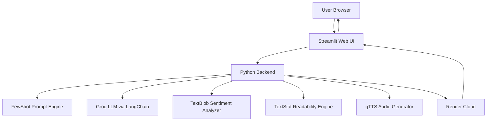

# AI-Powered LinkedIn Content Generator

An AI-powered web application that generates **high-quality LinkedIn posts** based on topic, length, tone, and language preferences.  
The system leverages **Groq LLM via LangChain**, provides **sentiment analysis**, **readability scoring**, and **text-to-speech audio output**, and is deployed on **Render Cloud**.

## Live Demo

🔗 **Live App:**  https://genai-post-generator-erv2.onrender.com  


## Features

✔️ Generate professional LinkedIn posts instantly  
✔️ Select:
- Topic  
- Length (Short / Medium / Long)  
- Tone (Professional / Casual / Motivational / Storytelling)  
- Language (English, Hinglish, French, Spanish)  
✔️ Emoji toggle  
✔️ Auto hashtag generation  
✔️ Sentiment analysis score  
✔️ Readability score  
✔️ Text-to-Speech audio playback  
✔️ Loading spinner + progress bar  
✔️ Cloud deployed (Render)  


##  System Architecture



## Local Setup 

### 1. Clone repository

```bash
git clone https://github.com/tusharjoshi1804/ai-linkedin-post-generator.git
cd ai-linkedin-post-generator
```

### 2. Install dependencies

```bash
pip install -r requirements.txt
```


### 3. Add environment variable

Create a `.env` file:

```env
GROQ_API_KEY=your_api_key_here
```

### 4. Run app locally

```bash
streamlit run main.py
```

Open in browser:
```
http://localhost:8501
```

## Deployment

This project is deployed on Render using GitHub integration.

- Build Command:
```bash
pip install -r requirements.txt
```

- Start Command:
```bash
streamlit run main.py --server.port $PORT --server.address 0.0.0.0
```

## License

This project is licensed under the MIT License.
